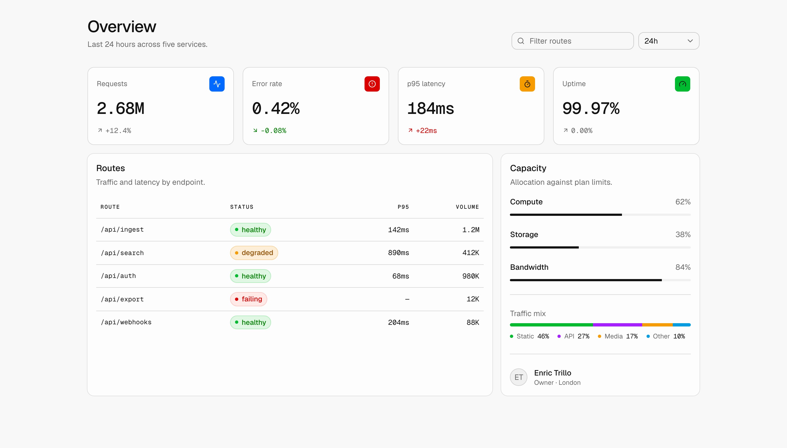
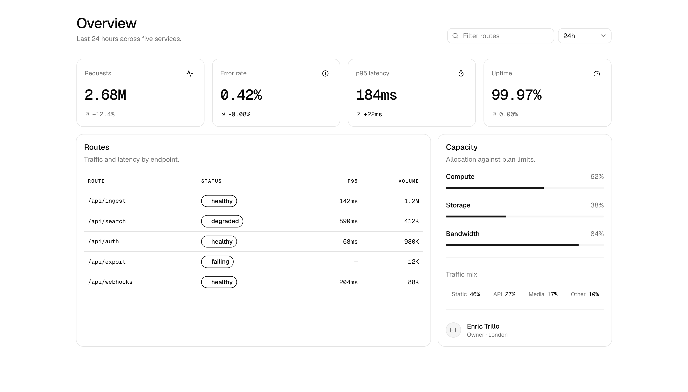
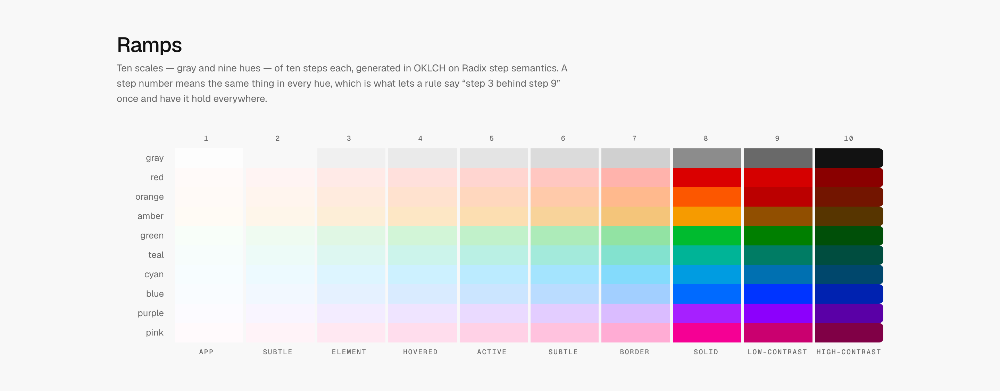

# Minima

A Tailwind v4 theme for interfaces that stay out of their own way. Neutral
carries the structure; colour is spent on state, identity and data, and nowhere
else.

It ships as **one CSS file**. Add it to an existing shadcn project and the
components you already have pick it up without being edited, because Minima
re-points Tailwind's own shadow, easing and colour scales at its rungs rather
than inventing a parallel set of names. (Radius is the one scale shadcn keeps —
see [docs/install.md](docs/install.md) for why, and the one-time edit that
hands it over.)

<picture>
  <source media="(prefers-color-scheme: dark)" srcset="docs/images/dashboard-minima-dark.png">
  
</picture>

### The same page, both ways

Same markup, same components, same class names. The only thing that changes is
which values sit behind shadcn's semantic names — which is the whole claim, and
the reason the theme is one file rather than a component library.

<table>
<tr>
<th width="50%">Stock shadcn</th>
<th width="50%">With Minima</th>
</tr>
<tr>
<td>
<picture>
  <source media="(prefers-color-scheme: dark)" srcset="docs/images/dashboard-stock-dark.png">
  
</picture>
</td>
<td>
<picture>
  <source media="(prefers-color-scheme: dark)" srcset="docs/images/dashboard-minima-dark.png">
  
</picture>
</td>
</tr>
</table>

Screens from the development lab, not something Minima ships — it ships tokens
and five components, and the page above is ordinary shadcn markup using them.

## Install

```bash
npx shadcn@latest add phugadev/minima/theme
```

Then one line in your global stylesheet, after the Tailwind import:

```css
@import "tailwindcss";
@import "../styles/minima.css";
```

That is the whole adoption cost. The full walkthrough, including what to check
first and what a failed install looks like, is in [docs/install.md](docs/install.md).

Components are separate and optional. Take them when you want them:

```bash
npx shadcn@latest add phugadev/minima/button
npx shadcn@latest add phugadev/minima/tabs
```

They land in your repo as your code, the way shadcn intends. Nothing in the
theme reaches into a component you own.

## What the theme alone gives you

| | |
|---|---|
| **Colour** | Ten OKLCH ramps generated on Radix step semantics, each step named for its role. Alpha rungs solved so a tint reproduces its opaque twin. |
| **Type** | Three registers — reading, signal, figure — plus a prose layer with its own measure and rhythm. |
| **Space** | A 2x ladder (inset, gutter, stack, section) and three density modes. |
| **Depth** | Four rungs, carried by shadow in light and by surface in dark. |
| **Motion** | Four durations, three curves, and reduced motion enforced globally. |
| **State** | Focus, hover, pressed and disabled, with a ring that clears 3:1 on every surface — on every element that takes focus, `contenteditable` included. |
| **Syntax** | A code palette generated from the same ramps, for Prism, highlight.js or Shiki. |

<picture>
  <source media="(prefers-color-scheme: dark)" srcset="docs/images/ramps-dark.png">
  
</picture>

Dark is not an inversion of light. Both ramps are generated against their own
mode, which is why step 9 is a legible text colour on either and why the two
sets are not mirror images of each other.

## A few of the decisions

**A container is not a mark.** Only a mark carrying meaning *alone* owes the
page 3:1. Holding a tinted tile to that floor drags warm hues down the ramp
until amber is gold — vivid and labelled beats muddy and technically compliant.

**Ask for a role, never a step number.** Every step has a name (`fill`,
`border`, `solid`, `text`). Renumbering the scale once left four files quietly
wrong; a name survives that, an ordinal does not.

**Text goes on a fill, never a tint.** A tint reproduces its step over paper or
ink only. Seven hue-and-ground pairs land between 4.20 and 4.48 on other
grounds — under the floor, but only just, which is what makes it dangerous.

**Each mode runs out of room at the opposite end.** Light cannot lighten a
surface past white; dark cannot darken a shadow past a page already at 10/255.
So light spends its range on the shadow and dark spends it on the surface.

**The type scale is `type-*`, not `text-*`.** Tailwind's `--text-*` namespace
would be the obvious choice and it is a trap: `cn()` carries a hardcoded list
of font sizes, so a custom `text-body` is filed as a *colour*, collides with
`text-muted-foreground`, and is silently dropped.

**The components ship a configured `cn`.** The same hardcoded table has a
second failure mode that naming cannot fix: an unrecognised utility gets its
own private group, so it never *collapses* with the stock class it replaces and
both survive — leaving the stylesheet order to decide instead of your
`className`. `rounded-lg rounded-control-xs` rendered at 10px instead of 8, and
`<Button className="h-control-lg" />` did nothing at all.

## Verified, not asserted

Every rule ships with the thing that proves it. `npm run audit` runs twelve
checks over the built CSS and the registry:

```
ramps       every contrast floor holds across 110 pairings
alpha       every tint reproduces its opaque step within one 8-bit step
depth       two-layer cast shadows on surfaces that carry text
motion      curves face the right way, exits beat entrances
state       the focus ring clears 3:1 on every surface a control can sit on
prose       measure is readable, rhythm groups headings, links are not colour alone
native      the browser knows the scheme, every target clears 24px
syntax      every token is legible on the code ground and none are confusable
cascade     no dangling var(), and nothing unlayered outranks a utility
components  every component is expressed in tokens, no literals
merge       every utility is registered and displaces its stock counterpart
registry    every item resolves, every dependency is an address
```

Two more need a real browser, because they are about what a consumer's build
actually produces rather than about a value:

```bash
URL=http://localhost:3000 npm run audit:live      # reduced motion, focus rings

APP=../some-install npm run coverage              # generate the page…
cd ../some-install && npm run build && npx next start -p 3210
URL=http://localhost:3210 APP=../some-install npm run audit:install
```

`audit:install` is the one that closes the longest-running hole here. Tailwind
only emits a utility it can see used in scanned source, so measuring one that
nothing asked for reads exactly like a broken token — a false alarm that cost a
detour six separate times. The coverage page is *generated from the theme file*,
so every token appears in scanned source by construction and a missing utility
can only mean the theme is wrong. It then separates the three bugs that share
that symptom: the token is undefined, the utility was not emitted, or it points
somewhere else.

Each of those exists because something broke. The registry check exists because
bare `registryDependencies` resolve to shadcn's items rather than ours, and an
earlier version of this project shipped that way.

## Development

```bash
npm run build          # ramps, syntax themes, then the bundled theme
npm run audit          # everything above
npm run audit:upstream # has shadcn moved structurally since we forked?
```

Sources live in `src/`. `registry/minima.css` is generated — do not edit it.

### The lab

Development happens against a private sibling checkout — a Next app holding the
same CSS, the same components and the same `cn`, as a page you can look at. It
is not published, and nothing here depends on it; `scripts/sources.mjs` is the
only file that knows a tree can be laid out either way, so every runner body is
identical in both and any app that installs the theme can host them.

The arrangement is worth describing even though the other half is private,
because it is the reason `audit-sync.mjs` exists. The runners used to be edited
copies, and copies drift toward whoever is looking: eleven had fallen behind,
one still reading a path that no longer existed, and a focus-ring fix went into
the lab's `globals.css` instead of into the theme — so the ring stayed broken
for every consumer while the check that would have caught it was pointed at the
one page where it could not happen. `audit-sync` compares every shared file and
fails if one has moved.

Components are forked from shadcn, and `.upstream/` records the exact source
they were forked from. `audit-upstream` compares structurally, blanking every
`className` and `cva()` call, so it reports what *they* changed rather than
what we did.

## Licence

MIT
